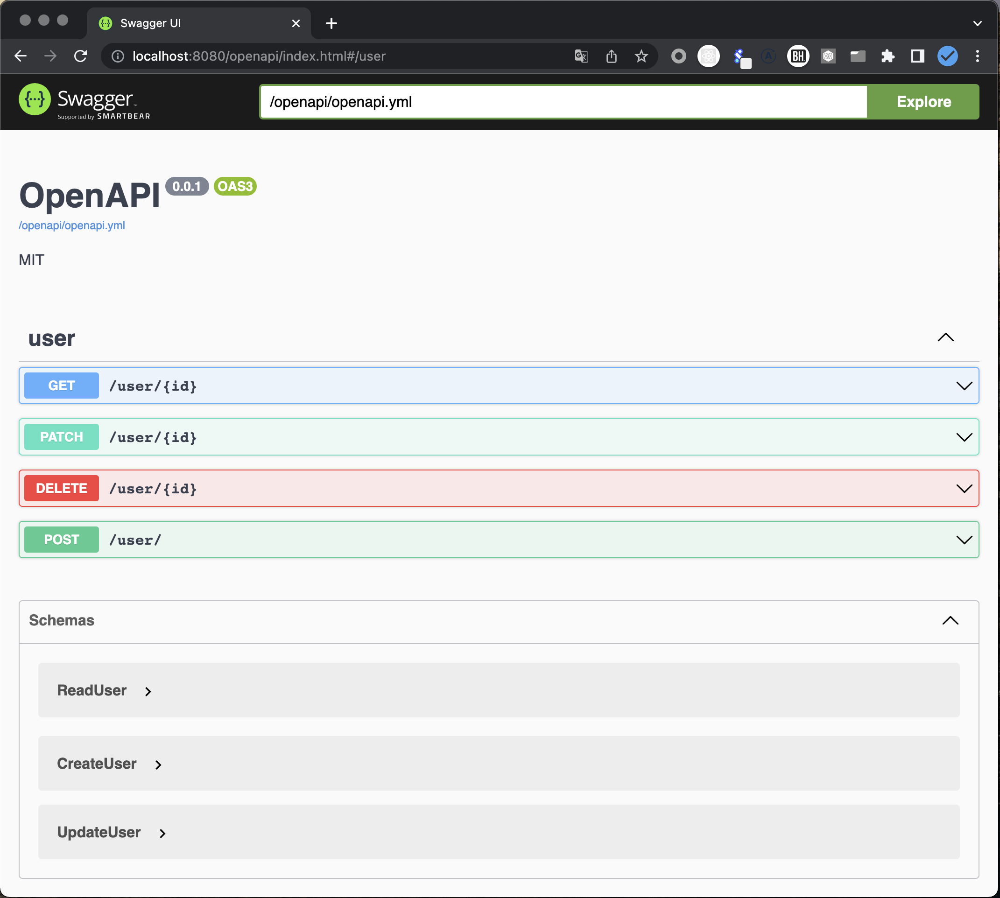

# Deepkit OpenAPI

<center>
    
</center>

<center>
    <i>from types, to types</i>
</center>


## Introduction

:warning:Hang tight! This library is under construction!:warning:

This is a [Deepkit Framework](https://deepkit.io/framework) module for automatically generating [OpenAPI V3](https://swagger.io/specification/) definitions.

If you wonder what Deepkit is, it is a TypeScript framework that adds [reflection](https://en.wikipedia.org/wiki/Reflective_programming) functonalities to the already great TS language. With Deepkit, the user exploits the richness of TypeScript syntax to define solid API interface, painless validation and runtime self checks. Learn more at its [offical site](https://deepkit.io/framework).

OpenAPI, on the other hand, is a popular schema for HTTP API definitions. There are countless serverside frameworks supporting it, like Java Spring, Django, FastAPI and NestJS, to name a few. However, it is Deepkit who has the potential to map code to OpenAPI definition with the least repeated code. Deepkit provides the ability to have TypeScript's static types in runtime, therefore no more decorators like `@ApiProperty` are needed.

## Get Started

### Install Deepkit Openapi

npm

```bash
npm install deepkit-openapi
```

yarn

```bash
yarn add deepkit-openapi
```

pnpm

```bash
pnpm add deepkit-openapi
```

### Import OpenAPIModule 

```ts
import { FrameworkModule } from "@deepkit/framework";
import { OpenAPIModule } from "deepkit-openapi";

// ...

@http.controller()
class UserController {
  // ...
}

new App({
  providers: [UserController],
  controllers: [UserController],
  imports: [
    new OpenAPIModule({ prefix: "/openapi/" }),  // Import the module here
    new FrameworkModule({
      publicDir: "public",
      httpLog: true,
      migrateOnStartup: true,
    }),
  ],
})
  .loadConfigFromEnv()
  .run();

```

### Start the Application

```bash
ts-node app.ts server:start

2022-06-04T15:14:57.744Z [LOG] Start server ...
2022-06-04T15:14:57.747Z [LOG] 4 HTTP routes
2022-06-04T15:14:57.747Z [LOG] HTTP Controller UserController
2022-06-04T15:14:57.747Z [LOG]   GET /user/:id
2022-06-04T15:14:57.747Z [LOG]   POST /user/
2022-06-04T15:14:57.747Z [LOG]   PATCH /user/:id
2022-06-04T15:14:57.747Z [LOG]   DELETE /user/:id
2022-06-04T15:14:57.747Z [LOG] HTTP listening at http://0.0.0.0:8080
2022-06-04T15:14:57.747Z [LOG] Server started.
```

Visit http://localhost:8080/openapi/index.html



Now you get your OpenAPI documentation up and running with a single line of code! No annotation needed!

```ts
new OpenAPIModule({ prefix: "/openapi/" })
```
